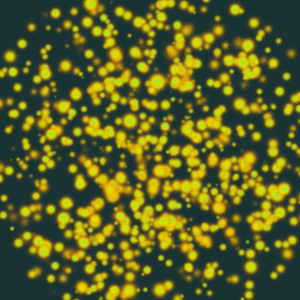
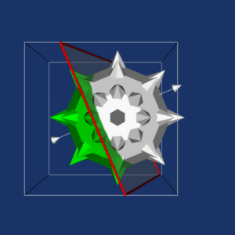
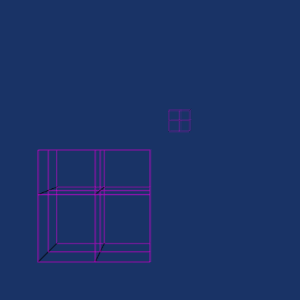
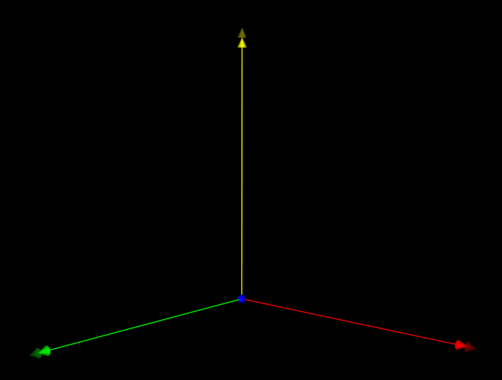

# 9.2.0 Release Notes

Changes made since VTK 9.1.0 include the following.

----------------------------------------

<a name="changes"></a>
## Changes {#changes}

<a name="build"></a>
### Build {#build}

- The `VTK_USE_MPI` and `VTK_USE_TK` options are more lenient and will not
  force any modules in the `MPI` or `Tk` group, respectively, to be built.
  Instead, affected modules may be disabled if they are unwanted.
- VTK's packages now hint OpenVR locations (for the build tree or
  `VTK_RELOCATABLE_INSTALL=OFF` installations).
- Installation destinations for Python modules is now fixed under MinGW.
- Compile fixes for older compilers, mainly GCC 4.8.

<a name="core"></a>
### Core {#core}

- `vtkVector`'s `+=` and `-=` operators now return a `vtkVector&` as expected.
  Previously they returned uninitialized `vtkVector` instances which is of
  little use to anyone.
- `vtkSetGet.h` macros which create setters now have `*Override` variants to
  use the `override` keyword instead of repeating `virtual`.
- `vtkObject` instances may now be assigned a name used in reporting. It is not
  copied by `ShallowCopy` or `DeepCopy` copies.
- `vtkAbstractArray::CreateArray` now prefers creating sized integer arrays
  rather than arrays of basic C types. This is intended to help readers  get
  the correct size instead of having to remember whether `long` is 32 or 64
  bits on the given platform.

<a name="data"></a>
### Data {#data}

- The `vtkArrayListTemplate` helper class for `vtkDataSetAttributes`
  incorrectly held a `vtkDataArray*`. This meant that filters using the class
  could not support other arrays such as `vtkStringArray`. Now, it holds a
  `vtkAbstractArray*` to support these types. Users may adapt by using
  `vtkArrayDownCast` to obtain a `vtkDataArray*` if needed.

<a name="filters"></a>
### Filters {#filters}

- `vtkArrayCalculator`, `vtkmodules.numpy_interface.dataset_adapter`, and
  `vtkProgrammableFilter` support for `vtkHyperTreeGrid` has been improved.
- `vtkUnstructuredGridQuadricDecimation::NO_ERROR` has been renamed to
  `::NON_ERROR` to avoid conflicts with Microsoft Windows SDK headers.
- `vtkImprintFilter::ABSOLUTE` has been renamed to `::ABSOLUTE_TOLERANCE` to
  avoid conflicts with Microsoft Windows SDK headers.
- `vtkMeshQuality` and `vtkCellTypes` now use a `enum class
  QualityMeasureTypes` instead of `#define` symbols for metrics.
- `vtkCheckerboardSplatter` no longer has nested parallelism.
- `vtkmProbe` filters now return probed fields as point data rather than cell
  data.
- `vtkDescriptiveStatistics`'s Kurtosis formula had a mistake which is now
  corrected.
- `vtkDescriptiveStatistics` previously supported toggling kurtosis, skewness,
  and variance over sample or population individually. Now, sample or
  population can be selected using the `SampleEstimate` boolean (on by
  default). This simplifies interactions with the filter and avoids confusion
  by mixing and matching. The previous APIs still exist, but do not do anything.
- `vtkPlaneCutter` now frees the sphere trees if the input changes and can
  handle `vtkUniformGridAMR` inputs.
- `vtkPlaneCutter` now uses `vtkAppendPolyData` internally to merge internal
  results. This avoids complex `vtkMultiBlockDataSet` inputs from creating
  complicated sets of `vtkMultiPieceDataSet`. Inputs and outputs are now
  transformed as follows:
  - `vtkMultiBlockDataSet` input becomes `vtkMultiBlockDataSet`
  - `vtkUniformGridAMR` input becomes `vtkPartitionedDataSetCollection`
    (previously `vtkMultiBlockDataSet`)
  - `vtkPartitionedDataSetCollection` input becomes
    `vtkPartitionedDataSetCollection`
  - `vtkPartitionedDataSet` input becomes `vtkPartitionedDataSet`
  - `vtkDataSet` input becomes `vtkPolyData` (previously
    `vtkPartitionedDataSet`)
- `vtkCellTreeLocator` has moved from `VTK::FiltersGeneral` to
  `VTK::CommonDataModel`
- `vtkArrayCalculator` no longer calls `Modified()` on any value setting
  because it causes multi-threaded contention.
- The `vtkArrayRename` filter may be used to rename data arrays within a data
  set.
- `vtkGeometryFilter` no longer supports the `vtkUnstructuredGrid::FastMode`
  using the `Degree` flag.
- `vtkTemporalDataSetCache` no longer crashes when a nonexistent timestep is
  requested.
- `vtkTableFFT` no longer prefixes output array names with "FFT_" like it was in 9.1
  and just keep the same name as the input like it was doing before 9.1. A new API
  has been added to keep 9.1 behavior when needed.
- `vtkContourTriangulator` polygon bounds checking now factors in the tolerance.
- `vtkImageDifference` calculations have been fixed. Note that this may affect
  testing results.
- `vtkLagrangianParticleTracker` caching invalidation logic fixed.

<a name="interaction"></a>
### Interaction {#interaction}

- `vtkFrustumSelection` has been optimized.
- Selection extraction on `vtkUniformGridAMR` has been fixed.

<a name="io"></a>
### I/O {#io}

- The `vtkIOSSReader` now provides `DisplacementMagnitude` to scale point
  displacement.
- The `vtkIOSSReader` now turns off the `LOWER_CASE_VARIABLE_NAMES` IOSS
  property.
- `vtkIOSSReader` now reads side sets correctly by avoiding a false positive
  hit in its internal cache.
- FFmpeg 5.0 is now supported.
- `vtkXdmfReader` no longer caches internal `XdmfGrid` instances to avoid
  wasting memory. See #19633.
- `vtkJSONSceneExporter` no longer overwrites existing files.
- `vtkGLTFExporter` now exports the correct camera transformation matrix.
  Imported scenes may use `vtkGLTFImporter::SetCamera(0)` prior to `Update()`
  to use the original camera location.
- `vtkPLYWriter` may now write the point normals of input meshes, if present.
- `vtkPIOReader` now requires dump files to begin with the problem name. This
  avoids using an unrelated file for partially written dumps.
- `vtkNetCDFCAMReader` now properly extracts level data.

<a name="rendering"></a>
### Rendering {#rendering}

- `vtkProp3D` actors may now be added using different coordinate frames:
  `WORLD` (the default), `PHYSICAL` (in VR, the physical room's coordinates, in
  meters), and `DEVICE` (relative to the device). When using `PHYSICAL` or
  `DEVICE`, a renderer must be provided via the new
  `SetCoordinateSystemRenderer()` and `SetCoordinateSystemDevice()` methods.
  Such props should typically use `UseBoundsOff()` to ignore their bounds when
  resetting the camera.
- Unstable volume rendering configurations are detected.
- Volume rendering now supports more than 6 lights.
- `vtkXOpenGLRenderWindow` and `vtkXRenderWindowInteractor` now properly
  disconnects from the display when it is not owned.
- Add a missing GIL lock in `vtkMatplotlibMathTextUtilities`.
- Avoid a hard-coded translation when resetting the camera in VR.

<a name="python"></a>
### Python {#python}

* SDKs for each weekly wheels are now available on `vtk.org`. Releases will
  also have them available.
* `vtkmodules.qt` now supports PyQt6.
* Python 3.10 is now supported by `vtkpython`.
* Python 3.10 wheels are now supported.
* VTK's wrapped classes may now be interposed by using the class' `override`
  decorator:

```python
from vtkmodules.vtkCommonCore import vtkPoints

@vtkPoints.override
class foo(vtkPoints):
  pass

o = vtkPoints() # o is actually an instance of foo
```

  * Note that Python subclasses still cannot override C++ `virtual` functions,
    cannot alter the C++ class hierarchy, is global, and is ignored when the
    class uses `vtkObjectFactory` to provide a subclass from its `::New()`
    method.
* `.pyi` files for autocompletion and hinting in editors are now available in
  VTK builds and wheels. Note that Windows wheels older than 3.8 do not provide
  `.pyi` files for platform-specific reasons.
* Starting with 9.2.3, Python 3.11 is supported and newly-deprecated APIs are
  avoided.
* Starting with 9.2.3, Matplotlib 3.6 is now supported.
* Starting with 9.2.3, `vtk[web]` is required to get web dependencies with the
  wheels.

<a name="web"></a>
### Web {#web}

- Fix a memory leak in `vtkWebApplication`.
- The render window serializers were updated to better map VTK options to
  VTK.js options. This includes font coloring for scalar bars and color
  transfer function discretization.
- `vtkDataSetSurfaceFilter` is used in place of `vtkGeometryFilter`
- The generic mapper serializer now uses `vtkDataSetSurfaceFilter` to always
  extract a surface from the input dataset.
- Python `print` statements were changed to DEBUG logging statements.

<a name="third-party"></a>
### Third Party {#third-party}

- VTK's vendored HDF5 library has been updated to 1.13.1.
- VTK's vendored `verdict` library has been updated.
- VTK's vendored `freetype` library has been updated to 2.12.0.
- VTK's vendored `mpi4py`'s Cython updated to support Python 3.11.
- Avoidance of deprecated APIs in new FFmpeg releases.
- VTK's vendored `libproj` better supports cross-compilation.

<a name="infrastructure"></a>
### Infrastructure {#infrastructure}

- Modules may now specify license files for the module in their `vtk.module`
  file. It will automatically be installed.

----------------------------------------

<a name="new-features"></a>
## New Features {#new-features}

<a name="animation"></a>
### Animation {#animation}

- Animations may now be played in reverse using `vtkAnimationCue`'s direction
  to `vtkAnimationCue::PlayDirection::BACKWARD`

<a name="build"></a>
### Build {#build}

- When `VTK::AcceleratorsVTKmFilters` is enabled, the
  `VTK_ENABLE_VTKM_OVERRIDES` option may be turned on to provide factory
  overrides for other VTK filters. Note that for these overrides to be used,
  the relevant VTKm modules must be linked (for C++) or imported (for Python)
  to be effective.

<a name="core"></a>
### Core {#core}

- `vtkMath::Convolve1D` can be used to compute the convolution of two 1D
  signals using `full`, `same`, or `valid` boundary conditions.
- `vtkReservoirSampler` may be used to perform reservoir sampling. It is
  intended for selecting random fixed-size subsets of integer sequences (e.g.,
  array indices or element IDs).

<a name="charts"></a>
### Charts {#charts}

- The parallel coordinates chart now supports multiple selections on the same
  axis. This includes addition, subtraction, and toggle actions.

<a name="filters"></a>
### Filters {#filters}

- The `vtkGenerateTimeSteps` filter may be used to add timesteps to
  shallow-copied data within a pipeline.
- The `vtkHyperTreeGridGradient` filter may be used to compute a gradient over
  a scalar field. The edges of the dual is used, so all neighbors are
  considered, but coarse cells are ignored.
- The `vtkExtractParticlesOverTime` filter may extract particles over time that
  pass through a given volumetric dataset.
- `vtkMultiObjectMassProperties` now also computes the centroids of each
  object. Centroids are calculated using tetrahedron centroids and uniform
  density.
- `vtkJoinTables` may perform a SQL-style `JOIN` operation on two `vtkTable`
  objects. The columns to keep depend on the mode: `intersection` (keep columns
  common to both tables), `union` (keeps columns present in either table), and
  `left` and `right` (keeping the keys present in the respective input table).
- `vtkComputeQuantiles` has been split out of `vtkComputeQuartiles` as a new
  superclass. It supports arbitrary numbers of buckets.
- `vtkMeshQuality` and `vtkCellQuality` have:
  - been multithreaded
  - improved documentation
  - no longer supports the `AspectBeta` tetrahedron metric
  - improved pyramid cell metrics:
    - `EquiangleSkew`
    - `Jacobian`
    - `ScaledJacobian`
    - `Shape`
    - `Volume`
  - improved wedge cell metrics:
    - `Condition`
    - `Distortion`
    - `EdgeRatio`
    - `EquiangleSkew`
    - `Jacobian`
    - `MaxAspectFrobenius`
    - `MaxStretch`
    - `MeanAspectFrobenius`
    - `ScaledJacobian`
    - `Shape`
    - `Volume`
  - new triangle cell metrics:
    - `EquiangleSkew`
    - `NormalizedInradius`
  - new quadrilateral cell metrics:
    - `EquiangleSkew`
  - new tetrahedron cell metrics:
    - `EquiangleSkew`
    - `EquivolumeSkew`
    - `MeanRatio`
    - `NormalizedInradius`
    - `SquishIndex`
  - new hexahedron cell metrics:
    - `EquiangleSkew`
    - `NodalJacobianRatio`
- The new `vtkLinearTransformCellLocator` is a cell locator adaptor which can
  calculate a transformation matrix from a base dataset to another dataset.
  This matrix is then used to perform cell locator operations. The
  `UseAllPoints()` method may be used to use either all dataset points (if the
  transformation might not be linear) or, at most, 100 sample points sampled
  uniformly from the dataset's point array.
- `vtkCellLocator`, `vtkStaticCellLocator`, `vtkCellTreeLocator`,
  `vtkModifiedBSPTree`, and `vtkLinearTransformCellLocator` each have numerous
  improvements:
  - support for `ShallowCopy()`
  - caching cell bounds has been multithreaded
  - `InsideCellBounds` checks are now cached
  - new `IntersectWithLine` methods sorted by a parametric `t`; this also
    provides `FindCellsAlongLine` for each locator
  - the `tolerance` parameter may be used to check cell bound intersections
  - The `UseExistingSearchStructure` parameter may be used to not rebuild
    locators when component data changes, but the geometry stays the same; use
    `ForceBuildLocator` to rebuild as needed in this case
- `vtkCellTreeLocator` supports 64bit IDs.
- `vtkCellTreeLocator::IntersectWithLine()` and
  `vtkModifiedBSPTree::IntersectWithLine()` are now thread-safe.
- `vtkCellLocator` is now fully thread-safe.
- The `vtkAlignImageDataSetFilter` has been added which can align image
  datasets to share a single global origin and offset extents in each component
  image accordingly. All images must use the same spacing.
- The new `vtkLengthDistribution` filter may be used to estimate the range of
  geometric length scales preset in a `vtkDataSet`.
- `vtkImageMathematics` can now perform operations on more than two images.
  Rather than connecting a second image to port 1, all connections are made to
  port 0 instead. This unifies behavior with other repeatable image filters
  such as `vtkImageAppend`.
- VTKm's `vtkmContour` filter may be used as a factory override for
  `vtkContourFilter`.
- VTKm filter factory overrides may be toggled using
  `vtkmFilterOverrides::SetEnabled()`.
- The `vtkExtractHistogram` filter has been moved from ParaView into VTK.
- `vtkPointDataToCellData` now handles categorical data using multiple threads.
- `vtkSuperquadricSource` now creates pieces using multiple threads.
- Particle traces now support `vtkDataObjectTree` objects to define seed points
  rather than only `vtkDataSet` objects.
- `vtkStreamTracer` now uses SMP when multiprocessing is not in use.
- `vtkStreamTracer` performance and quality have been improved.
- `vtkFindCellStrategy::FindClosestPointWithinRadius()` has been added.
- `vtkCompositeInterpolatedVelocityField::SnapPointOnCell()` has been
  refactored from the `vtkInterpolatedVelocityField` and
  `vtkCellLocatorInterpolatedVelocityField` subclasses.
- `vtkParticleTracerBase` is now multithreaded (with one MPI rank or more than
  100 particles).
- `vtkParticleTracerBase` can now use either use a cell locator (the default)
  or point locator for interpolation.
- `vtkParticleTracerBase` supports different levels of mesh changes over time:
  - `DIFFERENT`: the mesh changes on every timestep.
  - `SAME`: the mesh is the same on every timestep.
  - `LINEAR_TRANSFORMATION`: the mesh is a linear transformation of the prior
    timesteps (partially applies to point locators as only cell links are
    preserved).
  - `SAME_TOPOLOGY`: the mesh data changes, but its topology is the same every
    timestep (only applies to point locators).
- `vtkTemporalInterpolatedVelocityField` can now use the `FindCellStrategy`
  because it now preserves higher numerical accuracy internally.
- `vtkGeometryFilter` is now multi-threaded over more data types including:
  - `vtkUnstructuredGrid`
  - `vtkUnstructuredGridBase`
  - `vtkImageData` (3D)
  - `vtkRectilinearGrid`
  - `vtkStructuredGrid`
- `vtkGeometryFilter` can now handle ghost and blank cells and points.
- `vtkGeometryFilter` can now remove ghost interfaces using the
  `RemoveGhostInterfaces` flag (default on).
- The `vtkFiniteElementFieldDistributor` filter can now visualize Discontinuous
  Galerkin (DG) finite element fields of type `H(Grad)`, `H(Curl)`, and `H(Div)`.
  - Note that all cells must be of the same type and the field data must
    contain a `vtkStringArray` describing the DG fields, basis types, and
    reference cells.

<a name="interaction"></a>
### Interaction {#interaction}

- `vtkDisplaySizedImplicitPlaneWidget` is now provided. Compared to
  `vtkImplicitPlaneWidget2`:
  - the outline is not drawn by default
  - the intersection edges of the outline and the plane may be drawn
  - the normal arrow and plane size are relative to the viewport
    - their sizes may be bounded by the widget bounds
  - the origin may be moved freely rather than constrained to the bounding box
  - the handle sizes are larger
  - the plane is represented as a disc
  - the only option for the perimeter is to be tubed or not
  - the perimeter may be selected and resized to change the disc radius
  - the actors are highlighted only when hovered
    - except the plane surface which is highlighted when any actor is hovered
      over
  - a new plane origin may be picked using `P` or `p`
    - the `ctrl` modifier will snap to the closest point on an object or the
      camera plane focal point otherwise
  - a new plane normal may be picked using `N` or `n`
    - the `ctrl` modifier will snap to the closest normal on an object or the
      camera plane normal otherwise
  - picking tolerance is relative to the viewport size
- `vtkResliceImageViewer` may now apply a factor when scrolling.
- `vtkResliceCursorWidgetLineRepresentation` supports `alt+leftclick` to
  translate along a single axis.
- `vtkVRInteractorStyle` now supports the `Grounded` movement style. The
  existing movement style is called `Flying`. `Grounded` movement is
  constrained to an `xy` plane in four directions on one joystick. The other
  joystick changes elevation.
- `vtkSelection` now supports the `xor` boolean operator.
- `vtkSelectionSource` now supports multiple selection nodes.
- `vtkSelectionSource` may now define the field option using either `FieldType`
  or `ElementType`.
- `vtkSelectionSource` now defines the `ProcessId` of the selection.
- `vtkAppendSelection` can now append multiple selections through an expression
  using selection input names.
- `vtkConvertSelection` may now convert `BLOCK` and `BLOCK_SELECTORS` nodes to
  `INDICES`.

<a name="io"></a>
### I/O {#io}

- `vtkFidesReader` reader can now use the `Inline` engine for in-situ
  processing.
- `vtkCatalystConduit` may be used to adapt [Conduit][conduit] datasets via the
  [Catalyst][catalyst] library's [conduit interactions][catalyst-conduit]. This
  module requires an external `catalyst` library to be provided. This module
  includes:
  - `vtkConduitSource`: a source filter which generates a `vtkPartionedDataSet`
    or `vtkPartitionedDataSetCollection` from a Conduit node (it may also
    generate `vtkMultiBlockDataSet` if needed for historical reasons).
  - `vtkDataObjectToConduit` to convert any `vtkDataObject` into a Conduit node
  - a Catalyst implementation
- The `vtkHDFReader` filter now supports overlapping AMR datasets. The
  specification can be found in the
  [VTK File Formats documentation][vtk-examples-file-formats-hdf].
- `vtkCGNSReader` now support reading cell- or face-centered data arrays for
  meshes with 3D cells. Note that connectivity must be defined using `NGON_n`
  in face-based meshes. Data arrays are then defined with a `GridLocation_t` of
  either `CellCenter` or `FaceCenter`. The behavior may be selected by setting
  `vtkCGNSReader::DataLocation` to `vtkCGNSReader::CELL_DATA` (the default and
  previous behavior) or `vtkCGNSReader::FACE_DATA`.
- `vtkPIOReader` can now read restart block and even/odd dumps.
- `vtkPIOReader` will now add the `xdt`, `ydt`, `zdt`, and `rho` derived
  variables and calculate them if they are not already present in the restart
  file.
- `vtkIOSSReader` now caches time values internally to avoid filesystem
  contention on HPC systems.
- The new `vtkIOSSWriter` can write Exodus files using the IOSS library. For
  now, only element blocks, node sets, and side sets are supported.

[conduit]: https://llnl-conduit.readthedocs.io/en/latest/index.html
[catalyst]: https://gitlab.kitware.com/paraview/catalyst
[catalyst-conduit]: https://catalyst-in-situ.readthedocs.io/en/latest/introduction.html#relationship-with-conduit
[vtk-examples-file-formats-hdf]: https://kitware.github.io/vtk-examples/site/VTKFileFormats/#hdf-file-formats

<a name="qt"></a>
### Qt {#qt}

- `QVTKTableModelAdapter` may be used to provide a `QAbstractItemModel` model
  as a `vtkTable` to use in a pipeline.

<a name="rendering"></a>
### Rendering {#rendering}

- Basic OpenXR support is supported for virtual reality rendering.
- The `vtkHyperTreeGridMapper` mapper may be used to render only visible parts
  of a `vtkHyperTreeGrid` in 2D.
- Rendering point sets may now use OSPRay's "Particle Volume" when using
  `vtkPointGaussianMapper`'s ray tracing backend.
- `vtkColorTransferFunction::AddRGBPoints` may now be called with points and
  colors in batches for much better performance.
- The `WindowLocation` API has moved from `vtkTextRepresentation` to
  `vtkBorderRepresentation` so that it can be used by more classes.
- Volumetric shadows is now supported which allows for a volumetric model to
  cast shadows on itself. Requires volumetric shading to be enabled. An
  illumination reach parameter controls how accurate the shadows will be, `0`
  meaning only local shadows and `1` for shadows across the entire volume.



- Interactive rendering of most widgets are now supported with OSPRay.





<a name="widgets"></a>
### Widgets {#widgets}

- The `vtkCoordinateFrameWidget` controls 3 orthogonal right-handed planes.
  Axes are rendered proportionally to the viewport size (and is configurable).
  Interaction may pick a basis point and choose alignment with a surface normal
  or another point. See [this Discourse thread][discourse-cfw] for discussion.
- `vtkHardwarePicker` may be used to pick a point and normal by intersection
  with a mesh cell or nearest mesh point.



[discourse-cfw]: https://discourse.vtk.org/t/vtkcoordinateframewidget/7379

<a name="testing"></a>
### Testing {#testing}

- The `vtkHyperTreeGridPreConfiguredSource` may be used to generate different
  `vtkHyperTreeGrid` datasets for testing purposes instead of hand-crafting
  them.

<a name="wrapping"></a>
### Wrapping {#wrapping}

- Wrapping tools now support Unicode command line arguments.
- `vtkSmartPointer<T>` parameters and return values are now supported in
  wrapped Python APIs. `std::vector<vtkSmartPointer<T>>` is also supported by
  appearing as a `tuple` in Python and conversion from any sequence when
  converting to C++.

<a name="module-system"></a>
### Module System {#module-system}

- `vtk_module_sources` is now provided as a wrapper around `target_sources` for
  VTK module targets.
- `vtk_module_add_module` now supports a `NOWRAP_TEMPLATE_CLASSES` keyword for
  template classes which should not be wrapped.

<a name="deprecated-and-removed-features"></a>
## Deprecated and Removed Features {#deprecated-and-removed-features}

<a name="legacy"></a>
### Legacy {#legacy}

The following APIs were deprecated in 9.0 or earlier and are now removed:

- `vtkPlot::GetNearestPoint(const vtkVector2f&, const vtkVector2f&,
  vtkVector2f*)`
- `vtkPlot::LegacyRecursionFlag` (used to help subclasses implement the
  replacement for the prior method)
- The following APIs have been replaced by `vtkOutputWindow::SetDisplayMode()`:
  - `vtkOutputWindow::SetUseStdErrorForAllMessages()`
  - `vtkOutputWindow::GetUseStdErrorForAllMessages()`
  - `vtkOutputWindow::UseStdErrorForAllMessagesOn()`
  - `vtkOutputWindow::UseStdErrorForAllMessagesOff()`
  - `vtkWin32OutputWindow::SetSendToStdErr()`
  - `vtkWin32OutputWindow::GetSendToStdErr()`
  - `vtkWin32OutputWindow::SendToStdErrOn()`
  - `vtkWin32OutputWindow::SendToStdErrOff()`
- `vtkArrayDispatcher`, `vtkDispatcher`, `vtkDoubleDispatcher` have been
  replaced by `vtkArrayDispatch`
- Fetching edge and face points via `int` rather than `vtkIdType`:
  - `vtkConvexPointSet::GetEdgePoints(int, int*&)`
  - `vtkConvexPointSet::GetFacePoints(int, int*&)`
  - `vtkHexagonalPrism::GetEdgePoints(int, int*&)`
  - `vtkHexagonalPrism::GetFacePoints(int, int*&)`
  - `vtkHexahedron::GetEdgePoints(int, int*&)`
  - `vtkHexahedron::GetFacePoints(int, int*&)`
  - `vtkPentagonalPrism::GetEdgePoints(int, int*&)`
  - `vtkPentagonalPrism::GetFacePoints(int, int*&)`
  - `vtkPolyhedron::GetEdgePoints(int, int*&)`
  - `vtkPolyhedron::GetFacePoints(int, int*&)`
  - `vtkPyramid::GetEdgePoints(int, int*&)`
  - `vtkPyramid::GetFacePoints(int, int*&)`
  - `vtkTetra::GetEdgePoints(int, int*&)`
  - `vtkTetra::GetFacePoints(int, int*&)`
  - `vtkVoxel::GetEdgePoints(int, int*&)`
  - `vtkVoxel::GetFacePoints(int, int*&)`
  - `vtkWedge::GetEdgePoints(int, int*&)`
  - `vtkWedge::GetFacePoints(int, int*&)`
- Querying point cells with an `unsigned short` count of cells:
  - `vtkPolyData::GetPointCells(vtkIdType, unsigned short&, vtkIdType*&)`
  - `vtkUnstructuredGrid::GetPointCells(vtkIdType, unsigned short&,
    vtkIdType*&)`
- `vtkAlgorithm::SetProgress()` has been replaced by
  `vtkAlgorithm::UpdateProgress()`
- The following APIs have been replaced by
  `vtkResourceFileLocator::SetLogVerbosity()`:
  - `vtkResourceFileLocator::SetPrintDebugInformation()`
  - `vtkResourceFileLocator::GetPrintDebugInformation()`
  - `vtkResourceFileLocator::PrintDebugInformationOn()`
  - `vtkResourceFileLocator::PrintDebugInformationOff()`
- `vtkIdFilter::SetIdsArrayName()` has been replaced by
  `vtkIdFilter::SetPointIdsArrayName()` and
  `vtkIdFilter::SetCellIdsArrayName()`
- `vtkExtractTemporalFieldData` has been replaced by
  `vtkExtractExodusGlobalTemporalVariables`
- `vtkTemporalStreamTracer` and `vtkPTemporalStreamTracer` have been replaced
  by `vtkParticleTracerBase`, `vtkParticleTracer`, `vtkParticlePathFilter`, or
  `vtkStreaklineFilter`
- `vtkHyperTreeGridSource::GetMaximumLevel()` and
  `vtkHyperTreeGridSource::SetMaximumLevel()` have been replaced by
  `vtkHyperTreeGridSource::GetMaxDepth()` and
  `vtkHyperTreeGridSource::SetMaxDepth()`
- `QVTKOpenGLNativeWidget`, `QVTKOpenGLStereoWidget`, `QVTKOpenGLWindow`
  methods have been removed:
  - `::SetRenderWindow()` is now `::setRenderWindow()`
  - `::GetRenderWindow()` is now `::renderWindow()`
  - `::GetInteractor()` and `GetInteractorAdaptor()` have been removed
  - `::setQVTKCursor()` is now `QWidget::setCursor()`
  - `::setDefaultQVTKCursor()` is now `QWidget::setDefaultCursor()`
- `QVTKOpenGLWidget` is replaced by `QVTKOpenGLStereoWidget`
- `vtkJSONDataSetWriter::{Get,Set}FileName()` is now
  `vtkJSONDataSetWriter::{Get,Set}ArchiveName()`
- `vtkLineRepresentation::SetRestrictFlag()` has been removed
- The following `vtkRenderWindow` methods have been removed:
  - `GetIsPicking()`
  - `SetIsPicking()`
  - `IsPickingOn()`
  - `IsPickingOff()`
- The following APIs have been replaced by `vtkShaderProperty` methods of the
  same names:
  - `vtkOpenGLPolyDataMapper::AddShaderReplacement()`
  - `vtkOpenGLPolyDataMapper::ClearShaderReplacement()`
  - `vtkOpenGLPolyDataMapper::ClearAllShaderReplacements()`
  - `vtkOpenGLPolyDataMapper::ClearAllShaderReplacements()`
  - `vtkOpenGLPolyDataMapper::SetVertexShaderCode()`
  - `vtkOpenGLPolyDataMapper::GetVertexShaderCode()`
  - `vtkOpenGLPolyDataMapper::SetFragmentShaderCode()`
  - `vtkOpenGLPolyDataMapper::GetFragmentShaderCode()`
  - `vtkOpenGLPolyDataMapper::SetGeometryShaderCode()`
  - `vtkOpenGLPolyDataMapper::GetGeometryShaderCode()`
- The following APIs have been removed (they supported the legacy shader
  replacements):
  - `vtkOpenGLPolyDataMapper::GetLegacyShaderProperty()`
  - `vtkOpenGLPolyDataMapper::LegacyShaderProperty`
- The following APIs have been removed since only `FLOATING_POINT` mode is now
  supported:
  - `vtkValuePass::SetRenderingMode()`
  - `vtkValuePass::GetRenderingMode()`
  - `vtkValuePass::SetInputArrayToProcess()`
  - `vtkValuePass::SetInputComponentToProcess()`
  - `vtkValuePass::SetScalarRange()`
  - `vtkValuePass::IsFloatingPointModeSupported()`
  - `vtkValuePass::ColorToValue()`
- `vtkPythonInterpreter::GetPythonVerboseFlag()` has been replaced by
  `vtkPythonInterpreter::GetLogVerbosity()`
- `vtkUnicodeString` and `vtkUnicodeStringArray` have been removed. The
  `vtkString` and `vtkStringArray` classes are now fully UTF-8 aware. UTF-16
  conversion is no longer possible through VTK APIs.
- `vtkVariant` support for `__int64` and `unsigned __int64` has been removed.
  They have returned `false` for years.

<a name="core"></a>
### Core {#core}

- `vtkCellTypes` no longer uses `LocationArray`. It was used for
  `vtkUnstructuredGrid` but is now stored with the class instead. As of this
  deprecation, all supported APIs are now only `static` methods.
- `vtkUnstructuredGrid::GetCellTypes` is deprecated. Instead,
  `vtkUnstructuredGrid::GetDistinctCellTypesArray` should be used to access the
  set of cell types present in the grid.
- `vtkHyperTreeGrid::GetNumberOfVertices()` is now
  `vtkHyperTreeGrid::GetNumberOfCells()` to align with VTK's usage of the
  terminology.
- Classes may now opt into the garbage collection mechanism by overriding the
  `UsesGarbageCollector()` method to return `true` instead of via the
  `Register()` and `UnRegister()` methods.
- `vtkCriticalSection` is deprecated. `vtkCriticalSection` was intended to be
  deprecated in VTK 9.1.0, but a warning was never added to it. VTK now has the
  warning present as it was originally intended.

<a name="filters"></a>
### Filters {#filters}

- `vtkChemistryConfigure.h` has been deprecated. It previously only provided
  information to VTK's test suite which is now routed internally instead. There
  is no replacement and any usage can simply be removed.
- `vtkMFCConfigure.h` has been deprecated. It used to provide information used
  during the module's build that is now passed through command line flags
  instead. There is no replacement and any usage can simply be removed.
- `vtkMeshQuality`'s mechanism to run the filter in legacy mode is deprecated.
  In particular the `CompatibilityMode` and `Volume` members are no longer
  necessary with the new mode and should not be used anymore.
- `vtkMeshQuality` method renames:
  - `SetQuadQualityMeasureToMaxEdgeRatios` to
    `SetQuadQualityMeasureToMaxEdgeRatio`
  - `SetHexQualityMeasureToMaxEdgeRatios` to
    `SetHexQualityMeasureToMaxEdgeRatio`
  - `QuadMaxEdgeRatios` to `QuadMaxEdgeRatio`
  - `TetShapeandSize` to `TetShapeAndSize`
- `vtkDescriptiveStatistics::UnbiasedVariance`,
  `vtkDescriptiveStatistics::G1Skewness`, and
  `vtkDescriptiveStatistics::G2Kurtosis` are now deprecated in favor of a
  single `vtkDescriptiveStatistics::SampleEstimate` instead.
- `vtkCellLocator`, `vtkStaticCellLocator`, `vtkCellTreeLocator`,
  `vtkModifiedBSPTree`, and `vtkLinearTransformCellLocator` all have deprecated
  their `LazyEvaluation` flag due to thread-safety issues.
  `BuildLocatorIfNeeded` is also deprecated for those that supported it.
- `vtkStaticCellLocator:UseDiagonalLengthTolerance()` has been deprecated
  because it no longer uses `Tolerance`.
- `vtkParticleTracerBase::StaticMesh` is deprecated in preference to
  `vtkParticleTracerBase::SetMeshOverTime` (an enumeration rather than a
  boolean).
- `vtkCachingInterpolatedVelocityField`,
  `vtkCellLocatorInterpolatedVelocityField`, and `vtkInterpolatedVelocityField`
  filters have been deprecated. Instead, use:
  - `vtkCellLocatorInterpolatedVelocityField` becomes
    `vtkCompositeInterpolatedVelocityField` with `vtkCellLocatorStrategy`.
  - `vtkInterpolatedVelocityField` becomes
    `vtkCompositeInterpolatedVelocityField` with `vtkClosestPointStrategy`.
  - `vtkCachingInterpolatedVelocityField` becomes
    `vtkCompositeInterpolatedVelocityField` with the appropriate strategy.

<a name="interaction"></a>
### Interaction {#interaction}

- `vtkExtractSelectedThresholds`, `vtkExtractSelectedPolyDataIds`,
  `vtkExtractSelectedLocations`, `vtkExtractSelectedIds`, and
  `vtkExtractSelectedBlock` can now be replaced by `vtkExtractSelection`.
- `vtkHierarchicalBoxDataIterator` is now deprecated in favor of
  `vtkUniformGridAMRDataIterator`.

<a name="rendering"></a>
### Rendering {#rendering}

- `vtkOSPRayRendererNode::VOLUME_ANISOTROPY`,
  `vtkOSPRayRendererNode::GetVolumeAnisotropy()`, and
  `vtkOSPRayRendererNode::SetVolumeAnistropy()` are deprecated in favor
  of`vtkVolumeProperty::SetScatteringAnisotropy()` and
  `vtkVolumeProperty::GetScatteringAnisotropy()`.

<a name="other-changes"></a>
## Other Changes {#other-changes}
